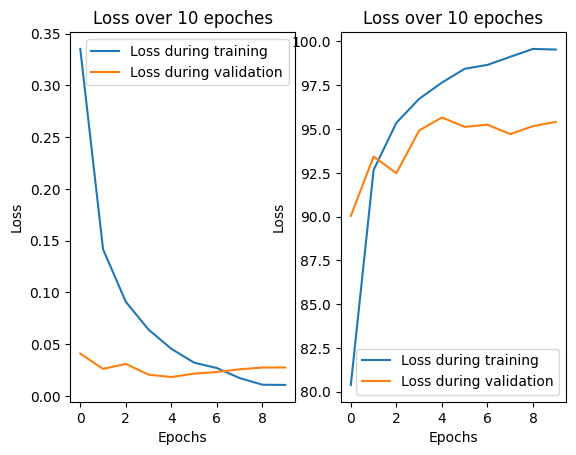

# Animal Faces Classification using CNN (PyTorch)

## Project Overview
This project implements a Convolutional Neural Network (CNN) using PyTorch to classify animal faces. The model is trained on the Animal Faces dataset from Kaggle and can distinguish between different animal categories.
The main objective of this project is to explore deep learning techniques for image classification and gain practical experience with PyTorch.

---

## Dataset
- **Source:** Animal Faces Dataset (Kaggle)  
- **Link:** https://www.kaggle.com/datasets/andrewmvd/animal-faces  
- **Description:**  
  The dataset contains labeled images of animal faces across multiple classes, making it suitable for image classification tasks.

---

## Results
- Training Accuracy: 99.5395% | Training Loss: 0.0106%
- Validation Accuracy: 95.4132%  | Validation Loss: 0.0275%
- Testing Accuracy: 96.1141% | Testing Loss: 0.0199%

