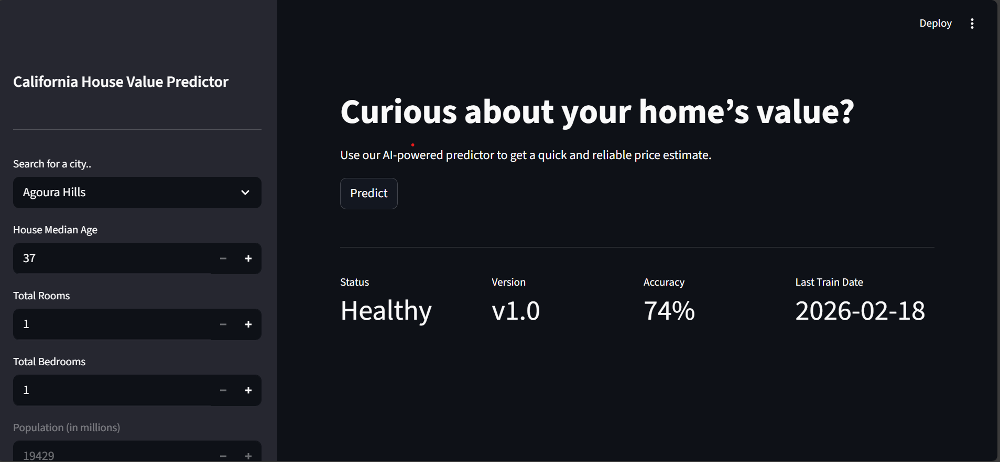

# House Price Predictor

A full-stack machine learning web application that predicts house prices using real housing data.

This project demonstrates an end-to-end ML system including data processing, model training, API development, frontend interface, and containerized deployment.

---

## Features

- Location-based house price prediction
- Machine Learning model (scikit-learn)
- FastAPI backend for inference
- Streamlit frontend interface
- Dockerized services

---

## 🖼️ Screenshots

### Home Page

### Prediction Result

---

## Tech Stack

### Backend
- Python
- FastAPI
- Pydantic
- scikit-learn
- Uvicorn

### Frontend
- Streamlit
- Requests

### DevOps
- Docker
- Docker Compose

### Data & ML
- Pandas
- NumPy
- Scikit-learn
- XGBoost

---

## Future Improvements
- Error handling
- Cloud deployment
- Model retraining
- Database integration
- CI/CD pipeline
- Usage analytics

